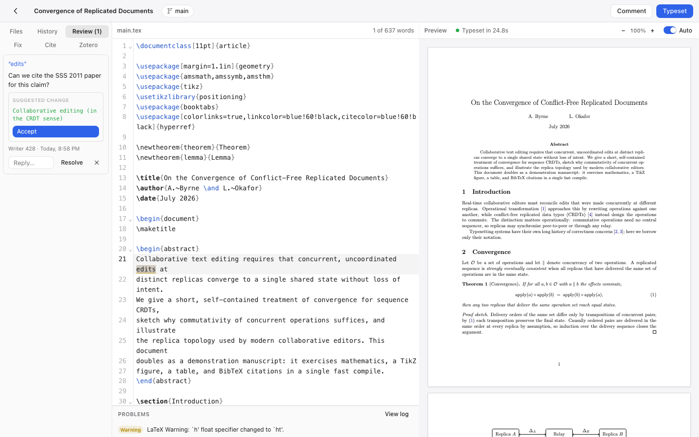
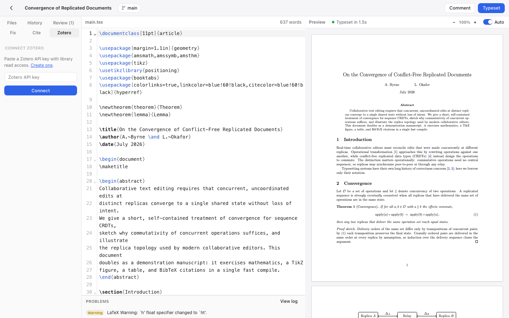
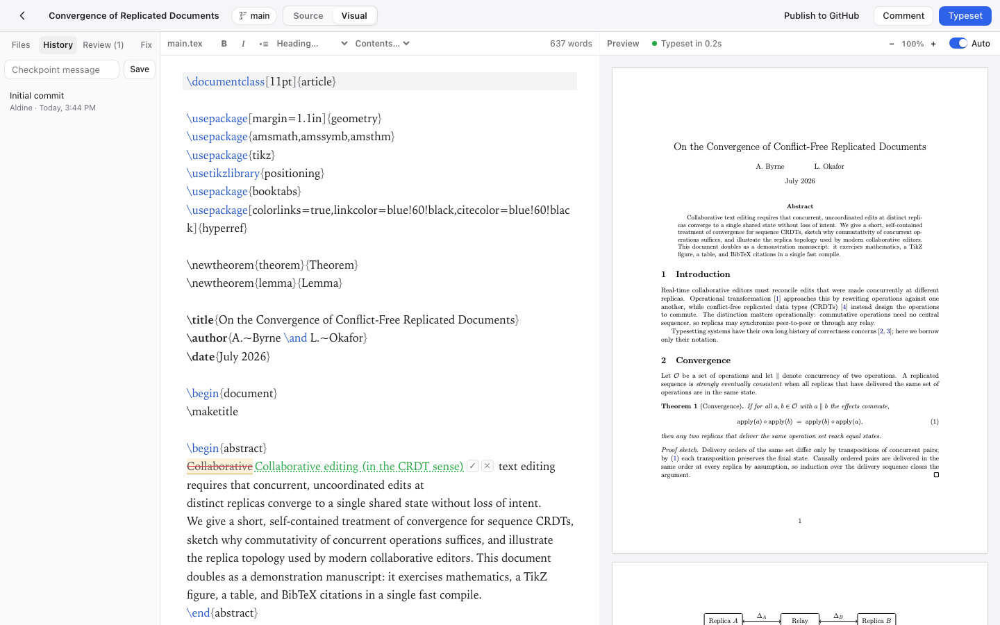

# Papyr

**Write LaTeX together. Fast, versioned, yours.**

[](https://github.com/trahloff/Papyr/actions/workflows/ci.yml)
[](LICENSE)
[](CONTRIBUTING.md)

Papyr is a slim, self-hosted, open-source LaTeX collaboration platform — an
Overleaf alternative built for speed and simplicity. Real-time multi-cursor
editing, every project a real git repo with branches, native Zotero, ~2s warm
recompiles. Two containers and flat files by default: no database to migrate,
nothing to babysit.

**[Try the live demo](https://demo.papyr.tobiasrahloff.com)** (resets nightly) ·
[Quick start](#quick-start) · [How Papyr compares](#how-papyr-compares) ·
[Screenshots](#screenshots) · [Self-hosting](#production-deploy) ·
[Contributing](CONTRIBUTING.md)

<picture>
  <source media="(prefers-color-scheme: dark)" srcset="e2e/shots/editor-dark.png">
  
</picture>

Live collaboration, a recompile, and a SyncTeX jump — one real, unedited recording:


> **Status:** Papyr is young (v0.x). It compiles real papers daily and every
> headline feature is exercised by a Playwright e2e suite in CI — but expect
> rough edges. File issues generously.

## Features

- **Real-time collaboration** — CRDT-based (Yjs), multi-cursor with live
  presence, conflict-free by construction. Unlimited collaborators.
- **Git-native with branches** — every project is a real git repository.
  Create branches, edit them independently, merge back — from the UI. Clone a
  project and keep using VS Code; pushes show up in the web editor.
- **Fast, sandboxed compiles** — TeX Live + latexmk with persistent
  incremental builds (~2s warm recompiles) in a no-egress container with
  restricted shell-escape; errors surfaced with line numbers and
  click-to-jump.
- **GitHub sync** — import a repo as a project, push/pull with ahead/behind
  indicators, conflict resolution, opt-in auto-sync, and open a pull request —
  all from the editor.
- **Native Zotero integration** — link your whole Zotero library *or a single
  collection*, no premium tier required; keep a `.bib` in sync with cheap
  version-aware refresh, insert citations from a search panel or via `\cite{`
  autocomplete.

<details>
<summary><strong>Everything else</strong> — review mode, AI error fix, SyncTeX, plugins, auth, scaling…</summary>

- **Review mode** — select text and leave an anchored, threaded comment;
  optionally attach a suggested replacement the author accepts with one click.
  Comments highlight in the editor, resolve/reopen, and track edits.
- **AI error fix** (optional, BYO key) — on a failed typeset, get a
  plain-English diagnosis and one-click fixes. Set `ANTHROPIC_API_KEY`,
  `OPENROUTER_API_KEY`, or `OPENAI_API_KEY` on the server to enable (that
  precedence order if several are set; `PAPYR_AI_MODEL` overrides the model).
  The key stays server-side and never reaches the browser. Unset the key and
  Papyr is a 100% AI-free editor.
- **Cite by DOI / arXiv** — paste an identifier, get BibTeX appended and the
  `\cite` inserted (no account, free public APIs).
- **SyncTeX both ways** — double-click the PDF to jump to source; ⌘J to jump
  the PDF to your cursor, with a highlight flash.
- **Plugin system** — manifest + ES module plugins extend the sidebar,
  editor, and commands. Zotero, references, and AI-fix ship as plugins;
  write your own.
- **Templates & import** — article, IAC conference paper, beamer,
  report/thesis; or import an existing project from an Overleaf ZIP.
- **Editor niceties** — auto-typeset on idle, live word count, spellcheck,
  PDF zoom, drag-drop figure upload, plain-English error hints + raw log,
  command palette (⌘K).
- **Multi-user auth** (optional) — set `AUTH_ENABLED=1` for login, per-project
  ownership, and sharing (invite-only or link). Google & GitHub SSO, or
  email/password (scrypt-hashed, revocable HTTP-only-cookie sessions);
  `PAPYR_SSO_ONLY=1` disables passwords entirely. Off by default
  (single-tenant); the collab socket is access-checked.
- **Scales when you need it** — flat-file storage by default; set
  `DATABASE_URL` for Postgres and `REDIS_URL` to run multiple app nodes. See
  [docs/SCALING.md](docs/SCALING.md).
- **Apple-style UI** — system fonts, hairline borders, light & dark mode,
  keyboard-first (⌘S typeset, ⌘J jump, ⌘K command palette).

</details>

## Quick start

```bash
docker compose up -d --build
open http://localhost:8080
```

That's it. Projects live in the `papyr-data` volume.

- **The first build is big**: it pulls a ~2.5 GB TeX Live image and installs
  LaTeX packages — expect 15–40 minutes on a fresh machine. Every build after
  that is cached and takes seconds. It's ready when
  `curl localhost:8080/api/health` returns `{"ok":true}`.
- **Port 8080 taken?** `PAPYR_PORT=18080 docker compose up -d` and open
  http://localhost:18080.

## How Papyr compares

| | Papyr | Overleaf CE (self-hosted) | git + VS Code + LaTeX Workshop |
|---|---|---|---|
| Deploy | 2 containers, `docker compose up` | Toolkit-managed monolith + Mongo + Redis | n/a (local) |
| Real-time collaboration | ✅ CRDT, unlimited collaborators | ✅ | ❌ (async via git) |
| Review comments / suggested edits | ✅ free | Server Pro (paid) | PR reviews |
| Git branches from the UI | ✅ projects *are* git repos | ❌ (git bridge is a paid feature) | ✅ (it *is* git) |
| GitHub sync + PRs from the editor | ✅ | Paid tiers | ✅ natively |
| Zotero | Whole library **or one collection**, free | Premium, whole library | Via Better BibTeX, manual |
| Warm recompile | ~2s (persistent latexmk cache) | Comparable | Fastest (local) |
| Templates gallery | 4 built-in | Huge community gallery — **they win** | CTAN / your own |
| Rich-text / visual editing | ❌ — **they win** | ✅ | ❌ |
| Maturity | Young (v0.x, 2026) — **they win** | A decade in production | Very mature |
| License | MIT | AGPL | MIT/varies |

If Overleaf CE fits you, use it — it's good software. Papyr exists for people
who want track changes, git, and Zotero without paid tiers, in a deployment
they can hold in their head.

## Screenshots

| | |
|---|---|
| <picture><source media="(prefers-color-scheme: dark)" srcset="e2e/shots/review-dark.png"></picture> | <picture><source media="(prefers-color-scheme: dark)" srcset="e2e/shots/branches-dark.png"></picture> |
| Review mode: threads + one-click suggestions | Branches: create, switch, merge from the UI |
| <picture><source media="(prefers-color-scheme: dark)" srcset="e2e/shots/zotero-dark.png"></picture> | <picture><source media="(prefers-color-scheme: dark)" srcset="e2e/shots/history-dark.png"></picture> |
| Zotero: cite from your library or collection | History: auto-checkpoints, named checkpoints, diffs |

## Development

```bash
npm install
npm run dev:server     # API + collab on :3000
npm run dev:web        # Vite on :5173 (proxies to :3000)
docker build -t papyr-compiler apps/compiler
docker run -d -p 4020:4020 -v $PWD/.data:/data papyr-compiler
```

### Tests

End-to-end (Playwright — covers compile, collab, branches, plugins, Zotero):

```bash
npx playwright install chromium
npm run test:e2e                          # self-starting stack on :3100
PAPYR_URL=http://localhost:8080 npm run test:e2e   # against docker compose
```

## Production deploy

```bash
# HTTPS via Caddy (auto-provisions certificates for your domain), with the
# production overlay: app bound to localhost only, proxy headers trusted,
# secure cookies, log rotation.
PAPYR_DOMAIN=papyr.example.com PAPYR_APP_BIND=127.0.0.1 \
docker compose -f docker-compose.yml -f deploy/docker-compose.prod.yml \
  --profile tls up -d --build

# Optional features are env-gated and off by default — set what you want
# (usually in a .env file next to docker-compose.yml):
#   AUTH_ENABLED=1                                   multi-user login
#   GOOGLE_OAUTH_CLIENT_ID/SECRET                    Google SSO
#   GITHUB_LOGIN_CLIENT_ID/SECRET                    GitHub SSO
#   GITHUB_CLIENT_ID/SECRET                          GitHub repo sync
#   OPENROUTER_API_KEY (or ANTHROPIC/OPENAI)         AI error fix
#   SMTP_HOST/PORT/USER/PASS/FROM or SES_FROM        password-reset email
#   PAPYR_PUBLIC_URL=https://papyr.example.com       absolute links (resets, OAuth)
#   SENTRY_DSN                                       error tracking

# Back up (data + secrets volumes) / restore
deploy/backup.sh papyr-backup.tar.gz
deploy/restore.sh papyr-backup.tar.gz   # stop the stack first: docker compose down
```

**Isolation & limits.** The compiler runs on an internal-only Docker network
(no internet egress), drops all Linux capabilities, and is bounded on CPU /
memory / PIDs; LaTeX compiles with **restricted shell-escape** (whitelist
only) and `openin_any=p`. Per-client rate limits guard login, AI, and
reference lookups; compiles are concurrency-capped, with optional per-user
compile quotas (`PAPYR_COMPILE_QUOTA_MIN`) if you host for a group.

See [deploy/README.md](deploy/README.md) for the full single-VPS runbook
(TLS, backups, SSO setup, Postgres/Redis, every config variable),
[deploy/aws](deploy/aws) for a Terraform/Fargate deployment, and
[SECURITY.md](SECURITY.md) for the threat model and how to report
vulnerabilities.

## Architecture

```
┌────────────┐   HTTP/WS    ┌──────────────────────────────┐
│  Browser   │ ───────────► │  app (Node 22)               │
│  React +   │              │  Fastify API + Hocuspocus    │
│  CM6 + Yjs │              │  git repos + worktrees       │
└────────────┘              └──────────┬───────────────────┘
                                       │ shared volume /data
                            ┌──────────▼───────────────────┐
                            │  compiler (TeX Live medium)  │
                            │  latexmk wrapper, sandboxed  │
                            └──────────────────────────────┘
```

- One Yjs document per file per branch (`project::branch::path`), persisted
  straight to the git worktree with debounced writes and auto-commits.
- Branches are git worktrees, so every branch is editable concurrently.
- Compile output stays inside the project tree (`.papyr-out/`, kept out of
  git history) which keeps latexmk's incremental cache warm.

### Data & storage

Two separate concerns, behind two seams:

- **Project files** — real git repos + worktrees on disk (`store.ts`). This is
  what gives you branches and history.
- **Relational/metadata** — users, sessions, project metadata, review comments,
  and usage — go through the `DataStore` interface (`db/`). Two backends:
  - **JSON files** (default, zero-dependency) — the slim single-node self-host.
  - **Postgres** (set `DATABASE_URL`) — the horizontally-scalable backend, for
    running multiple app nodes. `pg` is an optional dependency; the same test
    suite passes on both.

For how this scales past one box (and what the remaining walls are), see
[docs/SCALING.md](docs/SCALING.md).

## Plugins

A plugin is a folder in `plugins/`:

```
plugins/hello/
├── manifest.json   # { "id": "hello", "name": "Hello", "version": "1.0.0", "entry": "index.js" }
└── index.js        # export default { activate(papyr) { ... } }
```

The `papyr` API exposes `ui.registerSidebarPanel`, `editor.insertAtCursor`,
`project` context, `compile()`, `toast()`, and `fetch()`. See
`plugins/zotero` for a complete example.

## How Papyr was built

Most of this codebase was written by an AI agent (Claude) running in an
autonomous plan → implement → test → review loop, directed and reviewed by a
human — the commit history tells that story honestly. The trust argument is
the same as for any codebase: a Playwright e2e suite that exercises every
headline feature in a real browser, a sandboxed compiler, security review
passes, and CI gating every change. Judge the artifact, not the typist. The
original build plan is preserved in [docs/PLAN.md](docs/PLAN.md).

## License

[MIT](LICENSE). Overleaf is a trademark of its owners; Papyr is an
independent project, not affiliated with or endorsed by Overleaf.
