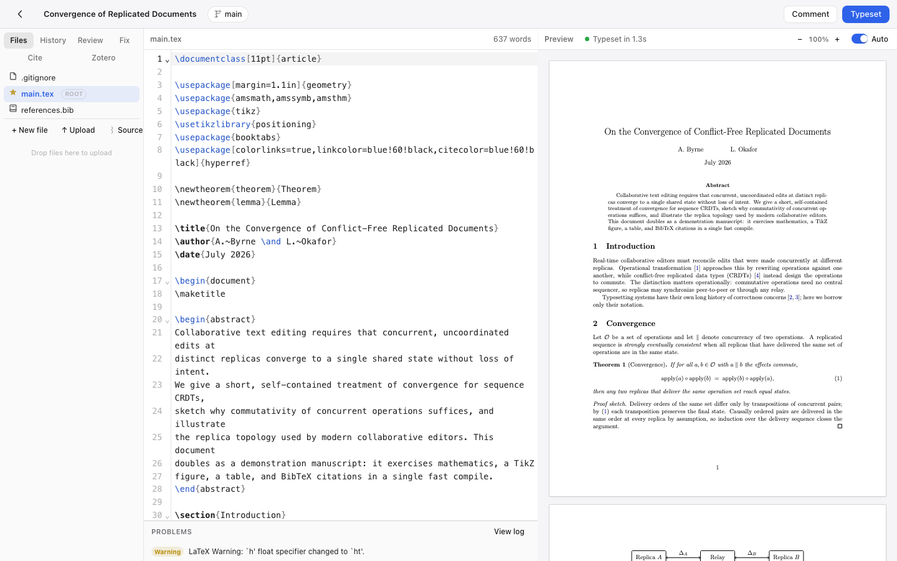

# Papyr

**Write LaTeX together. Fast, versioned, yours.**

Papyr is a slim, self-hosted, open-source LaTeX collaboration platform — an
Overleaf alternative built for speed and simplicity. Two containers, no Mongo,
no Redis, no 13-microservice sprawl.



## Features

- **Real-time collaboration** — CRDT-based (Yjs), multi-cursor with live presence,
  conflict-free by construction. Unlimited collaborators.
- **Fast LaTeX compilation** — TeX Live + latexmk with persistent incremental
  builds (~2s warm recompiles), sandboxed (`-no-shell-escape`, timeouts),
  errors surfaced with line numbers and click-to-jump.
- **Git-native with branches** — every project is a real git repository.
  Create branches, edit them independently, merge back — from the UI.
  Auto-checkpoints while you write, named checkpoints when you want them.
- **Native Zotero integration** — link your Zotero library *or a single
  collection* (Overleaf can't), keep a `.bib` in sync with cheap
  version-aware refresh, insert citations from a search panel or via
  `\cite{` autocomplete.
- **Plugin system** — manifest + ES module plugins extend the sidebar,
  editor, and commands. Zotero ships as a plugin; write your own in a folder.
- **Templates** — article, IAC conference paper, beamer, report/thesis.
- **Apple-style UI** — system fonts, hairline borders, light & dark mode,
  keyboard-first (⌘S to typeset).

## Quick start

```bash
docker compose up -d --build
open http://localhost:8080
```

That's it. Projects live in the `papyr-data` volume.

## Development

```bash
npm install
npm run dev:server     # API + collab on :3000
npm run dev:web        # Vite on :5173 (proxies to :3000)
docker build -t papyr-compiler apps/compiler
docker run -d -p 4020:4020 -v $PWD/.data:/data papyr-compiler
```

### Tests

End-to-end (Playwright — covers compile, collab, branches, plugins, Zotero):

```bash
npx playwright install chromium
npm run test:e2e                          # self-starting stack on :3100
PAPYR_URL=http://localhost:8080 npm run test:e2e   # against docker compose
```

## Architecture

```
┌────────────┐   HTTP/WS    ┌──────────────────────────────┐
│  Browser   │ ───────────► │  app (Node 22)               │
│  React +   │              │  Fastify API + Hocuspocus    │
│  CM6 + Yjs │              │  git repos + worktrees       │
└────────────┘              └──────────┬───────────────────┘
                                       │ shared volume /data
                            ┌──────────▼───────────────────┐
                            │  compiler (TeX Live medium)  │
                            │  latexmk wrapper, sandboxed  │
                            └──────────────────────────────┘
```

- One Yjs document per file per branch (`project::branch::path`), persisted
  straight to the git worktree with debounced writes and auto-commits.
- Branches are git worktrees, so every branch is editable concurrently.
- Compile output stays inside the project tree (`.papyr-out/`, gitignored)
  which keeps latexmk's incremental cache warm.

## Plugins

A plugin is a folder in `plugins/`:

```
plugins/hello/
├── manifest.json   # { "id": "hello", "name": "Hello", "version": "1.0.0", "entry": "index.js" }
└── index.js        # export default { activate(papyr) { ... } }
```

The `papyr` API exposes `ui.registerSidebarPanel`, `editor.insertAtCursor`,
`project` context, `compile()`, `toast()`, and `fetch()`. See
`plugins/zotero` for a complete example.

## License

MIT
